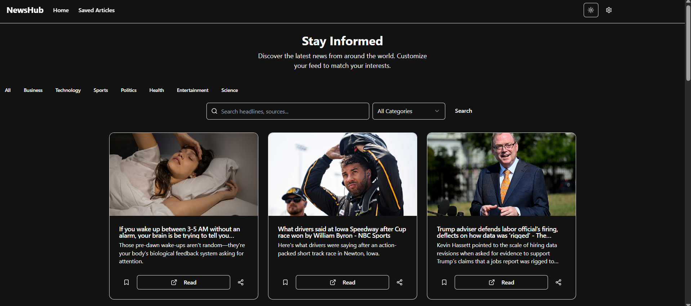
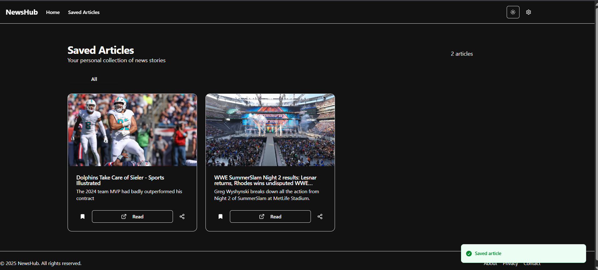

# 📰 NewsHub

**NewsHub** is a modern, responsive news aggregator app built with **React**, styled using **Tailwind CSS**, and powered by the elegant components of **ShadCN UI**. It fetches live news articles using the **NewsAPI** and displays them in a clean, intuitive interface.

## 🚀 Features

- 🗞️ Real-time news fetched from [NewsAPI.org](https://newsapi.org/)
- 🔍 Search and filter news by category or keyword
- 🌙 Dark mode support
- 📱 Responsive design for all screen sizes
- ⚡ Fast performance with optimized React components
- 🎨 Beautiful UI built with ShadCN UI and Tailwind CSS

## 🛠️ Tech Stack

- [React](https://reactjs.org/)
- [Tailwind CSS](https://tailwindcss.com/)
- [ShadCN UI](https://ui.shadcn.dev/)
- [NewsAPI](https://newsapi.org/)
- [Axios](https://axios-http.com/) (or fetch API)

## 📦 Installation

Clone the repository and install dependencies:

git clone https://github.com/coding-mrinal/news_app.git

cd newshub

npm install

## 🔧 Usage

1. **Set up your NewsAPI key**
   Create a `.env` file in the root of your project and add your NewsAPI key:
  
   VITE_NEWS_API_KEY=your_newsapi_key_here

2. **Run the development server**

   npm run dev

3. Open in your browser at:
   `http://localhost:3000`

## ✨ UI Preview

### 🖼️ Screenshot

Make sure to set your `VITE_NEWS_API_KEY` as an environment variable in the deployment settings.

## 🤝 Contributing

Contributions, suggestions, and pull requests are welcome!
Please fork the repository and submit your changes.

